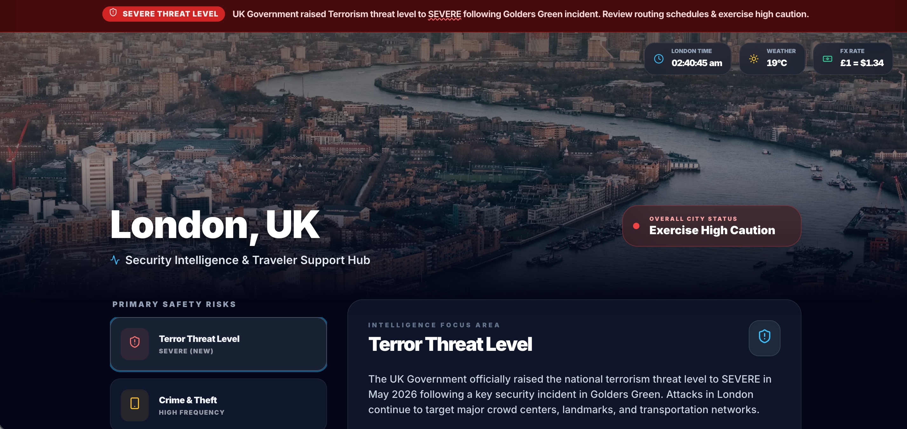
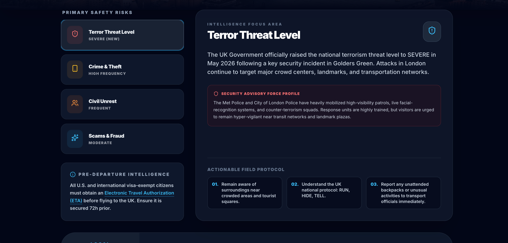
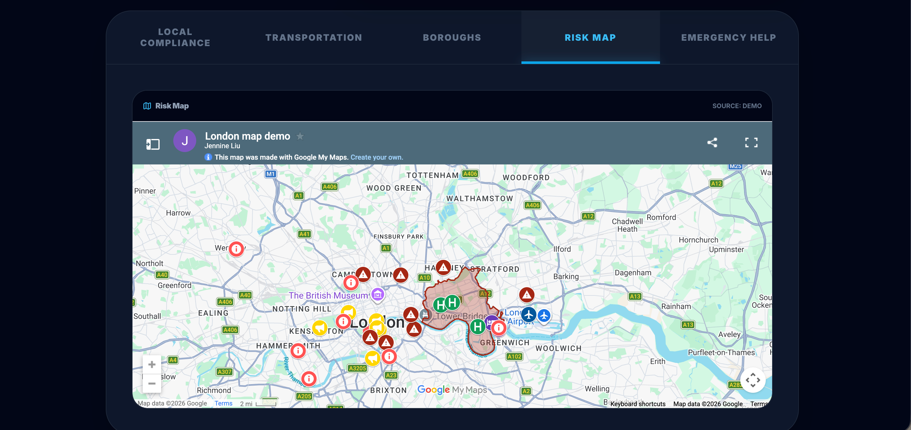
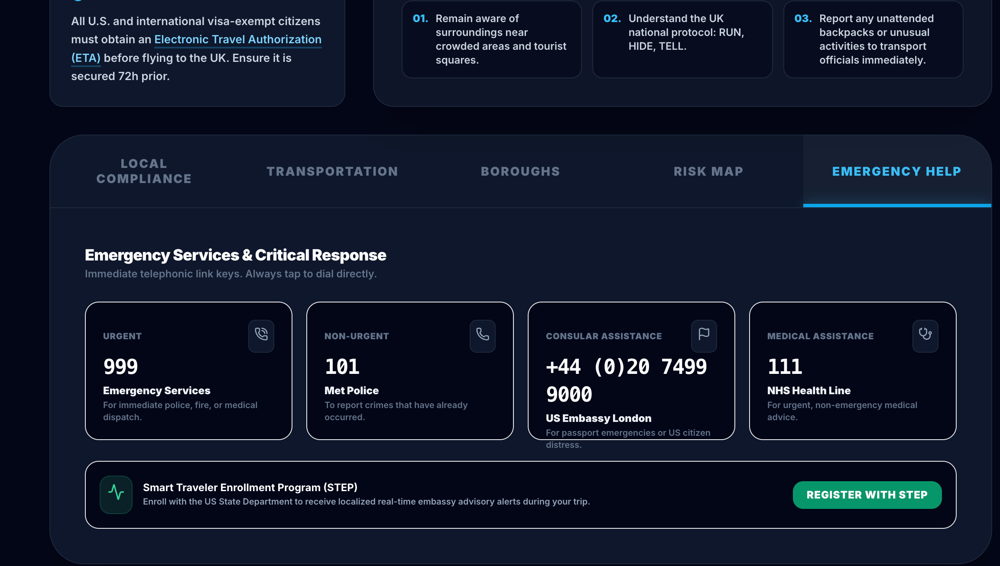
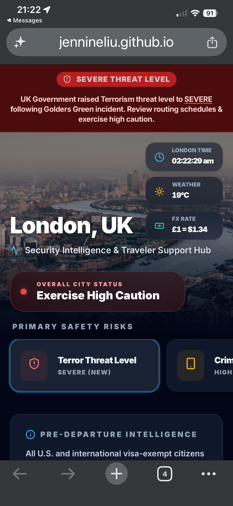
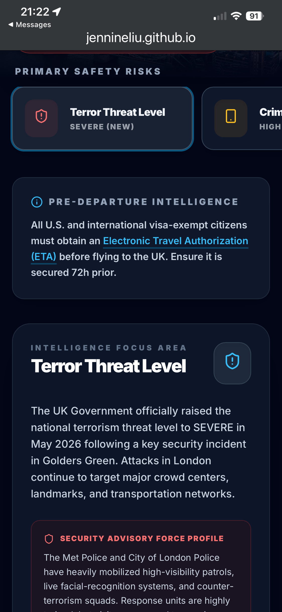
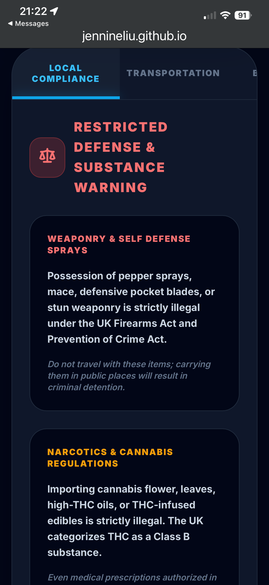
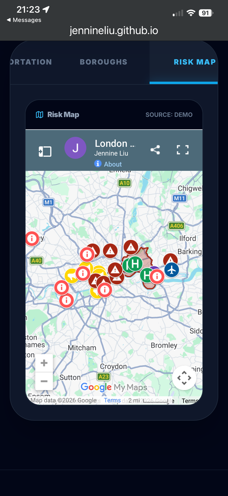

# AI Operational Intelligence Dashboard

Transforming static travel intelligence reporting into an interactive, mobile-first operational intelligence platform for global event operations.

## Live Demo

[Launch Interactive Dashboard](https://jennineliu.github.io/ai-travel-dashboard-demo/)

---

# Operational Problem

The client’s global esports operations team relied on multiple static PDF and PowerPoint travel security reports for each international event, creating operational friction across eight annual tournaments involving hundreds to thousands of travelers, vendors, staff, and event participants.

Intelligence products distributed through email, Slack, and WhatsApp created:
- fragmented information delivery
- inconsistent version control
- limited mobile usability
- poor accessibility during fast-moving operational environments

---

# Workflow Challenge

Initial dashboard prototypes were distributed through Gemini-hosted public links, creating privacy, authentication, and enterprise compliance concerns for operational deployment.

To support secure production usage, I deployed a private AWS S3 hosting workflow that:

- eliminated dependency on public Gemini-hosted links.
- reduced authentication friction for travelers.
- improved accessibility across large operational populations.
- enabled scalable deployment for international events.
- supported enterprise privacy and compliance requirements.

This transition also removed the need for travelers to authenticate into Google environments to access critical travel intelligence.

---

# Solution Overview

I designed an AI-assisted, mobile-first operational intelligence dashboard that transformed static travel security reporting into an interactive traveler support platform optimized for real-time operational use.

The dashboard centralized:
- security and threat intelligence.
- travel requirements and compliance guidance.
- emergency contacts and response procedures.
- transportation advisories.
- geospatial risk mapping.
- live traveler utility widgets.

All functionality was consolidated into a single operational interface accessible from both desktop and mobile devices.

---

# Dashboard Preview

## Desktop Experience

### Operational Dashboard Overview

### Threat Intelligence Panel

### Geospatial Risk Mapping

### Traveler Emergency Support

---

## Mobile Experience

### Mobile Dashboard Overview

### Mobile Threat Intelligence

### Mobile Compliance Guidance

### Mobile Crime Risk Intelligence

---

# Architecture

## System Architecture

### Frontend
- HTML
- React
- Tailwind CSS

### Dynamic Components
- React state management
- interactive modular UI panels

### Hosting
- private AWS S3 bucket deployment

### Mapping Layer
- embedded Google My Maps overlays

### External APIs
- Open-Meteo API for live weather data
- Frankfurter FX API for real-time currency exchange rates

### Security Improvements
- removed dependency on public Gemini-hosted links.
- reduced authentication friction.
- improved enterprise privacy and accessibility.

---

# Tooling Stack

- Gemini Canvas
- ChatGPT
- React
- Tailwind CSS
- AWS S3
- Google My Maps
- HTML/CSS/JavaScript
- Lucide Icons
- Open-Meteo API
- Frankfurter FX API

---

# AI Orchestration

Gemini Canvas and AI-assisted iterative development workflows were used to rapidly prototype, refine, and operationalize dashboard components.

AI-assisted workflows accelerated:
- UI prototyping.
- HTML/CSS generation.
- component iteration.
- information hierarchy refinement.
- traveler-focused UX improvements.
- operational content structuring.

The workflow combined human operational expertise with AI-assisted rapid prototyping to shorten development cycles and accelerate deployment readiness.

---

# UX & Operational Design Reasoning

The dashboard was intentionally designed as a mobile-first operational system rather than a traditional static intelligence report.

Key UX priorities included:
- rapid situational awareness.
- minimizing cognitive load during travel.
- centralized access to high-priority traveler information.
- reducing dependency on multiple documents.
- interactive navigation optimized for operational environments.

Dynamic traveler widgets including:
- live weather.
- real-time currency exchange.
- local time synchronization.
- embedded geospatial risk maps.

were incorporated to improve traveler self-sufficiency and operational usability during international events.

---

# Business Outcome

The dashboard fundamentally changed how travel intelligence was delivered during the client’s global esports operations.

The new workflow:
- reduced intelligence distribution friction.
- centralized operational information into a single interface.
- improved traveler accessibility at scale.
- accelerated intelligence-to-delivery timelines from days to operational-ready outputs.
- established a scalable framework for future enterprise deployments.

The client praised the solution’s creativity and operational fit, and the project was later featured in my company's inaugural enterprise AI newsletter as a first-mover operational AI implementation use case.

---

# Key Takeaways

This project explored how AI-assisted rapid prototyping, lightweight deployment infrastructure, and operational UX design can transform fragmented intelligence reporting workflows into scalable operational decision-support systems.

The result was a deployable, reusable framework optimized for:
- traveler accessibility.
- operational scalability.
- real-time intelligence delivery.
- mobile-first usability.
- enterprise deployment readiness.
